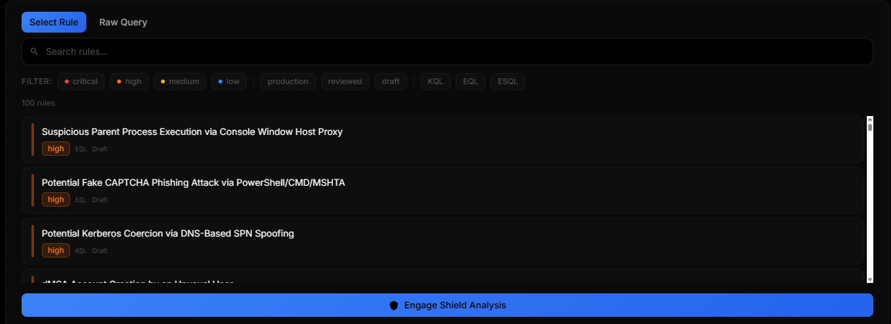
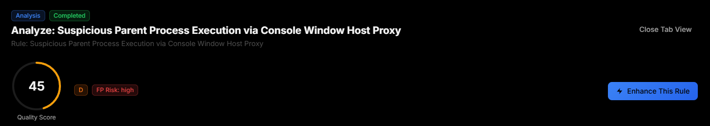
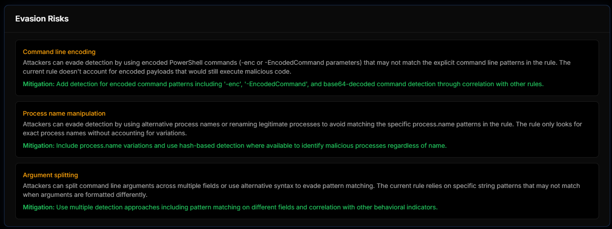
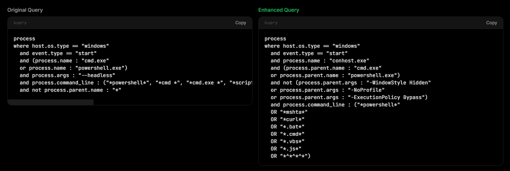
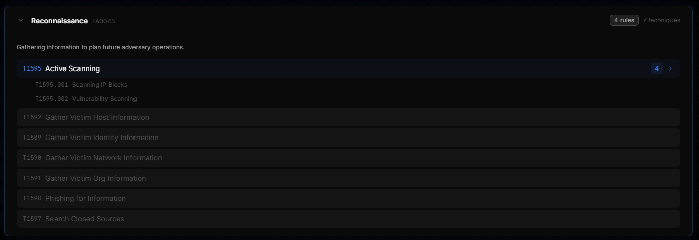
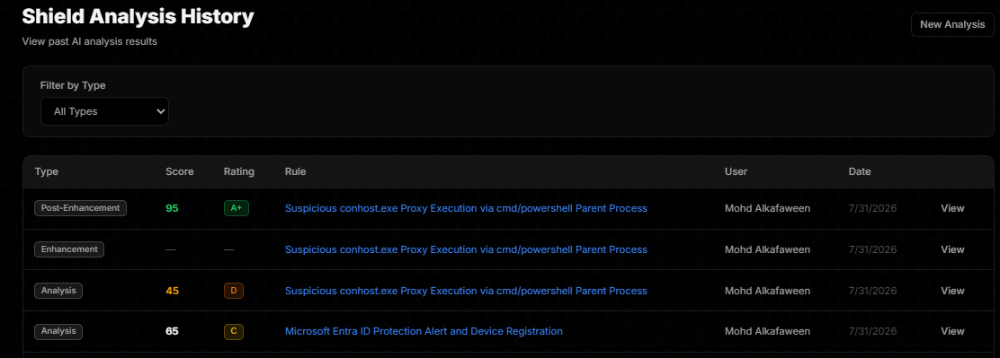
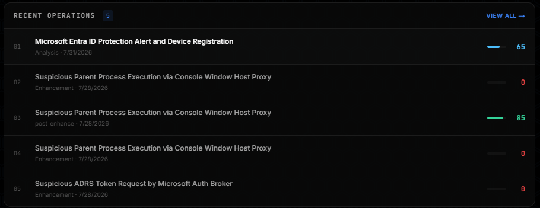

<div align="center">

# 🛡️ Odosian Shield

**AI-assisted detection engineering for Elastic Security**

Write, score, enhance, and generate SIEM detection rules — with an AI reviewer that grades every rule across 10 dimensions, maps it to MITRE ATT&CK, and red-teams your coverage in a simulation lab.

[](https://nextjs.org)
[](https://react.dev)
[](https://www.prisma.io)
[](https://www.typescriptlang.org)
[](https://tailwindcss.com)
[]()

</div>

---

## What it does

Detection engineers spend most of their time on work that never touches the actual threat: hand-tuning field names, second-guessing false-positive rates, and manually cross-referencing MITRE ATT&CK. Odosian puts an AI reviewer in that loop — grounded in the rule itself, not a generic chat window.

| | |
|---|---|
| ✍️ **Author** | KQL, EQL, ES\|QL, or Lucene in a full Monaco editor, with severity, risk score, and ATT&CK tags |
| 🧪 **Analyze** | AI scores the rule 0–100 across 10 dimensions — logic accuracy, FP potential, evasion resistance, noise ratio, and more |
| 🔧 **Enhance** | AI rewrites the query to fix what it found, side-by-side with the original |
| ✨ **Generate** | Describe the behavior in plain English, get a complete rule back |
| 🎯 **Map** | Interactive MITRE ATT&CK matrix — tactic → technique → sub-technique, with live rule coverage |
| 💥 **Simulate** | Red-team lab that generates real attack commands per technique, optionally run against a connected Kali box over SSH |
| 📁 **Organize** | Group rules into projects, build from templates, track every change in an immutable audit log |

---

## See it in action

<table>
<tr>
<td width="50%">

**Pick a rule, run the AI reviewer**

Filter 100+ rules by severity and query language, then hand one to Shield Analysis.



</td>
<td width="50%">

**Get a graded score, not a guess**

Every analysis returns a 0–100 quality score, a letter grade, and an explicit false-positive risk rating.



</td>
</tr>
<tr>
<td width="50%">

**Know exactly how it can be evaded**

Each finding comes with the specific evasion technique and a concrete mitigation — not vague advice.



</td>
<td width="50%">

**Enhance, then compare**

The AI rewrites the query to close the gaps it found. Original and enhanced sit side by side.



</td>
</tr>
<tr>
<td width="50%">

**Full ATT&CK coverage, browsable**

All 14 tactics, every technique and sub-technique, with live rule-coverage counts per node.



</td>
<td width="50%">

**Every operation, logged and scored**

Analyses, enhancements, and their before/after scores land in a single searchable history.



</td>
</tr>
</table>

<div align="center">

<br/><em>The dashboard keeps the last five operations one click away, score included.</em>
</div>

---

## Architecture

```
┌──────────────────────────────────────────────────────────────────────┐
│                         Odosian (Next.js 16)                         │
│                                                                        │
│   ┌─────────────┐   ┌──────────────┐   ┌───────────────────────┐     │
│   │  Rule Forge  │   │  Shield AI   │   │      Attack Lab       │     │
│   │  Monaco IDE  │──▶│  callAI()    │──▶│  ATT&CK → SSH → Kali  │     │
│   │  KQL·EQL·ESQL│   │  10-dim score│   │  (bypasses AI layer)  │     │
│   └──────┬───────┘   └──────┬───────┘   └───────────────────────┘     │
│          │                  │                                        │
│          ▼                  ▼                                        │
│   ┌─────────────────────────────────────────────────────────────┐    │
│   │      Prisma 7 + SQLite  —  16 models, 40+ API routes         │    │
│   │   Rule · Analysis · MitreMapping · Project · AuditLog · …    │    │
│   └─────────────────────────────────────────────────────────────┘    │
└───────────────────────────────┬────────────────────────────────────┘
                                 │  JWT (httpOnly) via src/proxy.ts
                                 ▼
                    ┌────────────────────────┐
                    │   Any OpenAI-compatible │
                    │   /chat/completions API │
                    │   (provider set in DB)  │
                    └────────────────────────┘
```

**Two request paths:** the standard path (Analyze / Enhance / Generate) always runs through the configured AI provider and lands in the `Analysis` table with a score. Attack Lab is deliberately separate — it talks to the LLM directly to script attacker behavior, and only reaches an actual machine if you've wired up a Kali connection yourself.

---

## Tech stack

| Layer | Choice |
|---|---|
| Framework | Next.js 16 (App Router, Turbopack), React 19, TypeScript 5 (strict) |
| Database | Prisma 7 + `better-sqlite3` driver adapter |
| Styling | Tailwind CSS v4 (`@theme`, no config file) |
| Auth | `jose` (JWT/HS256), `bcryptjs`, httpOnly cookies, RBAC (ADMIN / ANALYST) |
| Editor | Monaco (`@monaco-editor/react`), SSR-safe dynamic import |
| State | Zustand |
| Validation | Zod v4 |
| Charts | Recharts |
| Infra | Docker (multi-stage, `node:22-alpine`), Kubernetes manifests included |

<details>
<summary><strong>Database schema — 16 models</strong></summary>

| Model | Purpose |
|---|---|
| `User` | ADMIN/ANALYST roles, email verification, login lockout |
| `Rule` | Detection rules — query, severity, risk score, versioning |
| `Analysis` | AI results — score, rating, findings, suggestions, evasion risks |
| `MitreMapping` | Rule ↔ ATT&CK tactic/technique links with confidence |
| `Project` / `ProjectRule` | Logical grouping of rules |
| `AuditLog` | Immutable action log (actor, target, IP) |
| `Setting` / `Prompt` / `AIProvider` | Configurable AI behavior — no redeploy needed |
| `RuleTemplate` | Pre-built rules with variables |
| `CustomFieldDefinition` / `RuleCustomField` | User-defined rule schema extensions |
| `Webhook` | Outbound events, HMAC-signed |
| `RateLimit` | Per-user, per-endpoint sliding window |
| `KaliConnection` / `AttackSimulation` / `MitreAttackPrompt` | Attack Lab |

</details>

<details>
<summary><strong>API surface — 40+ endpoints</strong></summary>

- **Auth (8)** — login, register, verify, forgot/reset password, change password
- **Rules (7)** — CRUD, duplicate, import/export (JSON/CSV/Excel)
- **Analysis (6)** — analyze, enhance, generate, feedback, history
- **Attack Lab (6)** — simulate, Kali connect/execute, per-technique prompts
- **Everything else (25+)** — dashboard stats, projects, templates, MITRE data, audit log, users, settings, webhooks, custom fields

</details>

---

## Quick start

```bash
git clone https://github.com/MohdAlkafaween/odosian.git
cd odosian
npm install

cp .env.example .env        # set JWT_SECRET, AI provider, SMTP
npx prisma generate
npx prisma db push
npx prisma db seed          # seeds users, sample rules, templates, prompts

npm run dev                 # → http://localhost:3000
```

**Seeded accounts:**

| Role | Email | Password |
|---|---|---|
| Admin | `admin@odosian.com` | `Admin@123!` |
| Analyst | `analyst@odosian.com` | `Analyst@123!` |

### Docker

```bash
docker build -t odosian .
docker run -p 3000:3000 -v odosian-data:/data odosian
```

The entrypoint script initializes and seeds the database automatically on first run.

---

## Security posture

- JWT auth (HS256) in httpOnly, `SameSite=Strict` cookies
- bcrypt password hashing (cost 12), login lockout after repeated failures
- Zod-validated input with XSS sanitization on every mutating route
- Per-user, per-endpoint rate limiting
- Role-based access control (ADMIN / ANALYST) enforced at the route layer
- Full audit trail — every create/update/delete is attributed and logged
- Security headers by default: CSP, `X-Frame-Options: DENY`, `Referrer-Policy`, no camera/mic/geo permissions

---

<div align="center">

Built for detection engineers who'd rather review AI's work than write every field query by hand.

</div>
